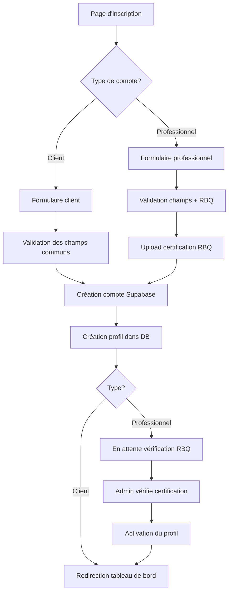

# Authentification & Inscription — BâtirNet

## Vue d'ensemble

BâtirNet offre un système d'authentification complet avec deux types de comptes distincts :
- **Client** : Pour les particuliers et entreprises cherchant des entrepreneurs
- **Professionnel** : Pour les entrepreneurs du bâtiment avec licence RBQ

## Fonctionnalités

### Inscription

#### Client
Les clients peuvent s'inscrire avec les informations suivantes :
- Email (requis)
- Mot de passe (minimum 6 caractères, requis)
- Nom complet (requis)
- Téléphone (optionnel)

#### Professionnel
Les professionnels doivent fournir en plus :
- Nom de l'entreprise (requis)
- Numéro RBQ (requis)
- Certification RBQ (fichier PDF, JPG ou PNG, max 5 Mo, requis)
- Services offerts (optionnel)
- Informations d'assurance (optionnel)

### Connexion

Les utilisateurs peuvent se connecter avec :
- Email et mot de passe
- OAuth Google (optionnel)

### Flux d'inscription



## Architecture technique

### Stack
- **Frontend** : React + TypeScript
- **UI** : shadcn/ui (Radix UI + Tailwind CSS)
- **Backend** : Supabase (PostgreSQL + Auth + Storage)
- **Validation** : Validation côté client et serveur

### Composants

#### `Auth.tsx`
Composant principal gérant l'authentification et l'inscription.

**États principaux :**
```typescript
const [isLogin, setIsLogin] = useState(true); // Mode connexion/inscription
const [userType, setUserType] = useState<UserType>("client"); // Type de compte
const [rbqFile, setRbqFile] = useState<File | null>(null); // Fichier RBQ
```

**Fonctions principales :**
- `handleLogin()` - Gère la connexion
- `handleSignUp()` - Gère l'inscription
- `handleFileChange()` - Gère la sélection de fichier RBQ
- `uploadRBQCertification()` - Upload le fichier vers Supabase Storage
- `handleGoogleAuth()` - Authentification OAuth Google

### Validation des fichiers RBQ

```typescript
// Types de fichiers acceptés
const validTypes = ['application/pdf', 'image/jpeg', 'image/jpg', 'image/png'];

// Taille maximale : 5 Mo
const maxSize = 5 * 1024 * 1024;
```

### Structure de données

#### Profil Client
```typescript
{
  id: string;              // UUID de l'utilisateur
  email: string;
  full_name: string;
  phone: string | null;
  user_type: "client";
  created_at: string;
  updated_at: string;
}
```

#### Profil Professionnel
```typescript
{
  id: string;
  email: string;
  full_name: string;
  phone: string | null;
  user_type: "professional";
  company_name: string;
  rbq_number: string;
  rbq_certification_url: string;
  services_offered: string | null;
  insurance_info: string | null;
  is_rbq_verified: boolean;    // Par défaut: false
  created_at: string;
  updated_at: string;
}
```

## Sécurité

### Row Level Security (RLS)

**Policies appliquées :**
1. Les utilisateurs peuvent lire/modifier uniquement leur propre profil
2. Les profils professionnels vérifiés sont visibles publiquement
3. Les certifications RBQ ne sont accessibles que par l'utilisateur et les admins

### Validation

**Côté client :**
- Validation des types de fichiers
- Validation de la taille des fichiers
- Validation des champs requis
- Validation du format email
- Validation de la longueur du mot de passe (min 6 caractères)

**Côté serveur :**
- Contraintes de base de données (NOT NULL, CHECK constraints)
- Validation des types via PostgreSQL ENUM
- Vérification de l'unicité de l'email

### Storage des certifications

**Organisation :**
```
certifications/
  └── rbq-certifications/
      └── {user_id}-rbq-{timestamp}.{extension}
```

**Policies :**
- Les utilisateurs peuvent uniquement uploader/lire leurs propres fichiers
- Les admins peuvent lire tous les fichiers
- Pas de politique de suppression (conservation pour audit)

## Interface utilisateur

### Onglets de type de compte

Le composant utilise les onglets shadcn/ui pour basculer entre les types :

```tsx
<Tabs value={userType} onValueChange={setUserType}>
  <TabsList>
    <TabsTrigger value="client">Client</TabsTrigger>
    <TabsTrigger value="professional">Professionnel</TabsTrigger>
  </TabsList>
</Tabs>
```

### Upload de fichier RBQ

Interface drag-and-drop avec feedback visuel :

```tsx
<Label htmlFor="rbq-file" className="...">
  {rbqFile ? (
    <CheckCircle2 /> // Fichier uploadé
  ) : (
    <Upload /> // En attente d'upload
  )}
</Label>
```

### Messages de notification

Utilisation du système de toasts shadcn/ui :

```typescript
toast({
  title: "Inscription réussie ! 🎉",
  description: "Votre compte a été créé avec succès !",
});
```

## Processus de vérification RBQ

### Pour les professionnels

1. **Inscription** : Le professionnel remplit le formulaire et upload sa certification
2. **Statut initial** : `is_rbq_verified = false`
3. **Limitations** : Le profil n'est pas visible publiquement

### Pour les administrateurs

1. **Dashboard admin** : Voir la liste des professionnels en attente
2. **Vérification** : Examiner la certification RBQ uploadée
3. **Validation** : Mettre à jour le statut à `is_rbq_verified = true`
4. **Activation** : Le profil devient visible et actif

### SQL de vérification manuelle

```sql
-- Vérifier un professionnel
UPDATE profiles 
SET is_rbq_verified = TRUE 
WHERE id = 'user-id' AND user_type = 'professional';

-- Lister les professionnels en attente
SELECT * FROM profiles 
WHERE user_type = 'professional' AND is_rbq_verified = FALSE
ORDER BY created_at DESC;
```

## Gestion des erreurs

### Erreurs courantes et solutions

| Erreur | Cause | Solution |
|--------|-------|----------|
| "Email already registered" | Email déjà utilisé | Utiliser un autre email ou se connecter |
| "Format de fichier invalide" | Fichier non PDF/JPG/PNG | Convertir le fichier au bon format |
| "Fichier trop volumineux" | Fichier > 5 Mo | Compresser ou redimensionner le fichier |
| "Champs requis manquants" | Champs obligatoires vides | Remplir tous les champs marqués * |
| "Certification RBQ requise" | Pas de fichier uploadé | Télécharger la certification |

### Gestion des erreurs dans le code

```typescript
try {
  // Inscription...
} catch (error: any) {
  toast({
    variant: "destructive",
    title: "Erreur",
    description: error.message || "Une erreur est survenue",
  });
}
```

## Intégration OAuth (US-002 — implémentée)

Les boutons « Continuer avec Google » et « Continuer avec Apple » sont en place
sur la page `/auth` (onglets Connexion et Inscription). Le code appelle
`supabase.auth.signInWithOAuth({ provider, options: { redirectTo: origin + "/auth" } })`.

**Comportement côté application :**
- Retour OAuth sur `/auth` : la session est détectée et l'utilisateur est
  redirigé selon son profil (`getPostAuthRoute`).
- Un nouvel utilisateur OAuth reçoit un profil `client` par défaut (trigger
  `handle_new_user_signup`). Si l'inscription a été initiée depuis l'onglet
  Inscription avec un type « Entrepreneur » ou « Pro métier », ce choix est
  conservé (localStorage, clé `batirnet_oauth_signup_choice`) le temps de
  l'aller-retour, puis appliqué au profil au retour ; l'utilisateur est alors
  dirigé vers le parcours de complétion de profil correspondant.
- Si un fournisseur n'est pas activé côté Supabase, l'utilisateur voit un
  message clair (« Ce mode de connexion n'est pas encore activé »).

**Configuration requise dans le dashboard Supabase (à faire avant la prod) :**

*Google :*
1. [Google Cloud Console](https://console.cloud.google.com) → créer des
   identifiants OAuth 2.0 (type « Application Web »).
2. Origine JavaScript autorisée : l'URL de production. URI de redirection :
   `https://gsnjnhxzacwjslirfxgy.supabase.co/auth/v1/callback`.
3. Supabase → Authentication → Providers → Google : activer, coller
   Client ID + Client Secret.

*Apple :*
1. [Apple Developer](https://developer.apple.com) (compte payant requis) →
   créer un App ID + Service ID avec « Sign in with Apple », générer la clé
   privée (.p8).
2. URL de retour : `https://gsnjnhxzacwjslirfxgy.supabase.co/auth/v1/callback`.
3. Supabase → Authentication → Providers → Apple : activer, renseigner
   Service ID, Team ID, Key ID et la clé privée.

*Dans les deux cas :* vérifier Authentication → URL Configuration →
`Site URL` = URL de production, et ajouter `https://<domaine>/auth` aux
`Redirect URLs`.

## Tests

### Tests à effectuer

**Tests fonctionnels :**
- [ ] Inscription client avec tous les champs
- [ ] Inscription client avec champs optionnels vides
- [ ] Inscription professionnel avec certification RBQ
- [ ] Validation des formats de fichier (PDF, JPG, PNG)
- [ ] Rejet des fichiers trop volumineux
- [ ] Connexion avec email/mot de passe
- [ ] OAuth Google
- [ ] Messages d'erreur appropriés
- [ ] Redirection après inscription

**Tests de sécurité :**
- [ ] RLS : Utilisateur ne peut pas lire les profils d'autres utilisateurs
- [ ] RLS : Utilisateur ne peut pas modifier d'autres profils
- [ ] Storage : Utilisateur ne peut pas accéder aux certifications d'autrui
- [ ] Validation : Champs requis ne peuvent pas être vides
- [ ] Validation : Email doit être unique

### Exemple de test unitaire

```typescript
import { render, screen, fireEvent } from '@testing-library/react';
import Auth from './Auth';

describe('Auth Component', () => {
  it('should render client tab by default', () => {
    render(<Auth />);
    expect(screen.getByText('Client')).toBeInTheDocument();
  });

  it('should switch to professional tab', () => {
    render(<Auth />);
    fireEvent.click(screen.getByText('Professionnel'));
    expect(screen.getByLabelText(/Nom de l'entreprise/)).toBeInTheDocument();
  });
});
```

## Améliorations futures

### Court terme
- [ ] Validation du format du numéro RBQ
- [ ] Aperçu du fichier RBQ avant upload
- [ ] Confirmation par email
- [ ] Récupération de mot de passe oublié

### Moyen terme
- [ ] 2FA (authentification à deux facteurs)
- [ ] Vérification automatique RBQ via API gouvernementale
- [ ] Dashboard admin pour gérer les vérifications
- [ ] Notifications en temps réel pour les admins

### Long terme
- [ ] Authentification biométrique
- [ ] Support multi-provinces (autres licences que RBQ)
- [ ] Intégration avec d'autres providers OAuth (Facebook, Apple)
- [ ] KYC/KYB avancé pour la conformité

## Ressources

- [Supabase Auth Documentation](https://supabase.com/docs/guides/auth)
- [shadcn/ui Components](https://ui.shadcn.com)
- [React Hook Form](https://react-hook-form.com)
- [Régie du bâtiment du Québec (RBQ)](https://www.rbq.gouv.qc.ca)

