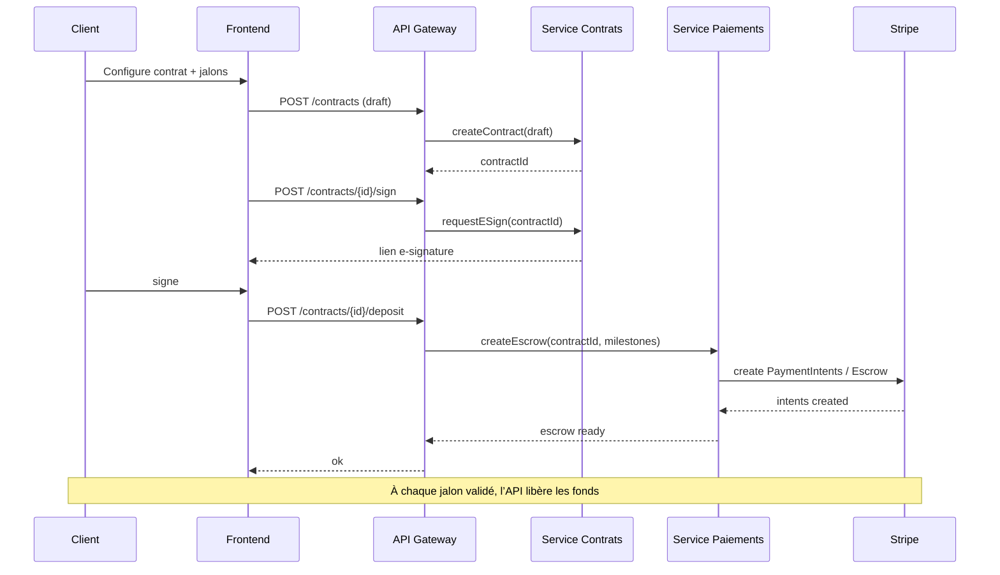

# Paiements & Escrow — BâtirNet

BâtirNet gère des paiements par jalons (escrow) avec Stripe. Les fonds sont déposés avant travaux et libérés après validation. Un processus de médiation peut bloquer/débloquer un jalon en cas de litige.

## Diagramme de flux
```mermaid
flowchart TD
  A[Client crée Contrat + Jalons] --> B[Dépot des fonds (Stripe Escrow)]
  B --> C[Travaux en cours]
  C --> D[Validation du jalon]
  D -->|OK| E[Libération des fonds au Pro]
  D -->|Litige| F[Médiation]
  F -->|Décision Pro| E
  F -->|Décision Client| G[Remboursement partiel/total]
  E --> H[Facture téléchargeable]
  G --> H
```

## Séquence (e‑signature et jalons)


## Anti‑fraude de base
- Vérification 3DS quand disponible.
- Limites par montant/jour, IP/device fingerprinting de base.
- Journal d’audit complet des opérations financières.

